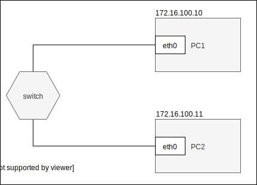
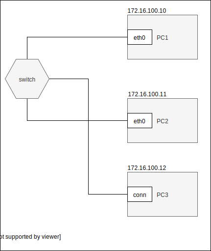

Ustawianie parametrów sieci ip
------------------------------

* stan interfejsu
    * interfejs up
    * interfejs down
* adresacja
    * dodaj adres
    * zmień adres
    * usuń adres
* routing
    * dodaj trasę default
    * dodaj trasę przez bramę
    * dodaj trasę przez interfejs
    * usuń trasę
    * zmień trasę
    * pobierz trasę dla adresu
* adresacja fizyczna
    * pokaż adresy interfejsów dostępnych w sieci
    * pokaż adresy dla konkretnego interfejsu
     

ip 
-------------------------
| subcommand    |  polecenie   | opis  |
| ------------- |:-------------| :---------------| 
|   ``addr``    |                               | infirmacje o adresacji i własnościach interfejsów |
|               |   ``ip addr``                 | informacja o wszystkich interfejsach              |
|               |   ``ip addr show dev enp0s3`` | informacja o konkretnym interfejsie               |
|   ``link``    |                               |  |
|               |   ``ip link set enp0s3 down`` | wyłącza interfejs                |
|               |   ``ip link set enp0s3 up``   | włącza interfejs                |
|   ``route``   |  |służy do zarządzania tablicami routingu wewnątrz jądra |
|               |     ``ip route add``                          | dodawanie tras do wybranej tablicy routingu         |
|               |      ``ip route list``/``ip route show``      | wyświetlania zawartości tablic routingu            |
|               |            ``ip route get``                   | znalezienie trasy do danego adresu                  |
|   ``maddr``   |  |wyświetla i pozwala zarządzać multicast IP |
|               |            ``ip maddr``                   | wyświetla informacje dla wszystkich urządzeń                |
|               |            ``ip maddr show dev enp0s3``                   | wyświetla informacje dla urządzenia enp0s3                |
|   ``neigh``   |  |zarządzanie i wyświetlanie tablicy sąsiedztwa |
|               |            ``ip neigh``                   | wyświetla tablice sąsiedztwa                |
|               |            ``ip neigh add/del``                   | dodaje lub usuwa pojedynczy wpis                 |
|               |            ``ip neigh change``                   | zmienia istniejący wpis                |
|               |            ``ip neigh show``                   | wyświetlanie zawartości tablicy sąsiedztwa                |
|   ``help``    |  |wyświetla listę komend i argumentów dla każdej podkomendy |

Zadanie
------------

1.
   * Przygotuj konfigurację sieci zgodnie z powyższym diagramem, 
   * Przetestuj połączenie poleceniem ping
2.
   * Zainstaluj na komputerze ``PC1`` serwer programu ``HTTP CHAT`` dostępnego pod adresem ``https://github.com/jkanclerz/http-chat``
   * Przetestuj komunikację wysyłając wiadomość z komputera ``PC2``, upewnij się czy jest widoczna w konsoli serwera
3.
   * Dodaj do istniejącej sieci komputer ``PC3`` pod kontroloą systemu windows
   * Skonfiguruj ``PC3`` zgodnie z poniższym diagramem
   * Zweryfkuj połączenie kożystając z przeglądarki, odwiedzając graficzny interfejs ``HTTP CHAT`` pod adresem ``http://172.16.100.10:8888``
   * Przygotuj dokumentację pisemno obrazkową z wykonania zadania w formacie ``markdown`` zamieść ją w serwisie ``github.com`` obok obocnego tematu ``cwiczenia-3``

 
